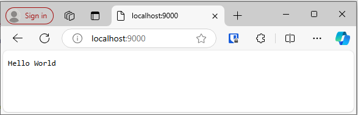
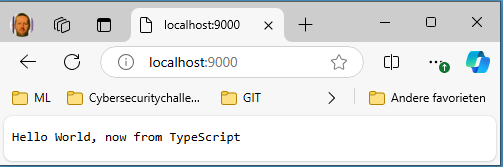
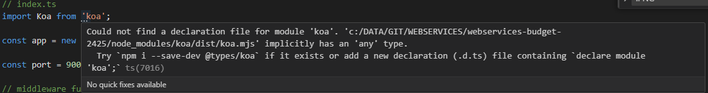

# webservices-budget-2425

## REST API intro

### Repository

```bash
Benny@FLAB2021 MINGW64 /c/DATA/GIT/WEBSERVICES/webservices-budget-2425
$ echo "# webservices-budget-2425" >> README.md

Benny@FLAB2021 MINGW64 /c/DATA/GIT/WEBSERVICES/webservices-budget-2425
$ git init
Initialized empty Git repository in C:/DATA/GIT/WEBSERVICES/webservices-budget-2425/.git/

Benny@FLAB2021 MINGW64 /c/DATA/GIT/WEBSERVICES/webservices-budget-2425 (main)
$ git add README.md

Benny@FLAB2021 MINGW64 /c/DATA/GIT/WEBSERVICES/webservices-budget-2425 (main)
$ git commit -m "initial commit (of empty directory)"
[main (root-commit) 4e61972] initial commit (of empty directory)
 1 file changed, 1 insertion(+)
 create mode 100644 README.md

Benny@FLAB2021 MINGW64 /c/DATA/GIT/WEBSERVICES/webservices-budget-2425 (main)
$ git branch -M main

Benny@FLAB2021 MINGW64 /c/DATA/GIT/WEBSERVICES/webservices-budget-2425 (main)
$ git remote add origin https://github.com/BennyClemmens/webservices-budget-2425.git

Benny@FLAB2021 MINGW64 /c/DATA/GIT/WEBSERVICES/webservices-budget-2425 (main)
$ git push -u origin main
info: please complete authentication in your browser...
Enumerating objects: 3, done.
Counting objects: 100% (3/3), done.
Writing objects: 100% (3/3), 262 bytes | 262.00 KiB/s, done.
Total 3 (delta 0), reused 0 (delta 0), pack-reused 0
To https://github.com/BennyClemmens/webservices-budget-2425.git
 * [new branch]      main -> main
branch 'main' set up to track 'origin/main'.
```

### Koa

Achteraf een `author`-veld toegevoegd en de repository link verwijderd, aangezien deze toch privé is.

```bash
benny@DESKTOP-NJMJN64 MINGW64 /c/DATA/GIT/WEBSERVICES/webservices-budget-2425 (main)
$ yarn init -p
! Corepack is about to download https://repo.yarnpkg.com/4.3.1/packages/yarnpkg-cli/bin/yarn.js
➤ YN0000: · Yarn 4.3.1
➤ YN0000: ┌ Resolution step
➤ YN0000: └ Completed
➤ YN0000: ┌ Fetch step
➤ YN0000: └ Completed
➤ YN0000: ┌ Link step
➤ YN0000: └ Completed
➤ YN0000: · Done in 0s 116ms

benny@DESKTOP-NJMJN64 MINGW64 /c/DATA/GIT/WEBSERVICES/webservices-budget-2425 (main)
$ ls -al
total 445
drwxr-xr-x 1 benny 197609      0 Oct 10 12:16 ./
drwxr-xr-x 1 benny 197609      0 Oct 10 12:08 ../
-rw-r--r-- 1 benny 197609    134 Oct 10 12:16 .editorconfig
drwxr-xr-x 1 benny 197609      0 Oct 10 12:14 .git/
-rw-r--r-- 1 benny 197609    142 Oct 10 12:16 .gitattributes
-rw-r--r-- 1 benny 197609    333 Oct 10 12:16 .gitignore
-rwxr-xr-x 1 benny 197609 432881 Oct 10 12:16 .pnp.cjs*
drwxr-xr-x 1 benny 197609      0 Oct 10 12:16 .yarn/
-rw-r--r-- 1 benny 197609   1474 Oct 10 12:14 README.md
-rw-r--r-- 1 benny 197609     98 Oct 10 12:16 package.json
-rw-r--r-- 1 benny 197609    342 Oct 10 12:16 yarn.lock

benny@DESKTOP-NJMJN64 MINGW64 /c/DATA/GIT/WEBSERVICES/webservices-budget-2425 (main)
$ yarn set version berry
➤ YN0000: Done in 0s 9ms

benny@DESKTOP-NJMJN64 MINGW64 /c/DATA/GIT/WEBSERVICES/webservices-budget-2425 (main)
$ echo "nodeLinker: node-modules" > .yarnrc.yml

benny@DESKTOP-NJMJN64 MINGW64 /c/DATA/GIT/WEBSERVICES/webservices-budget-2425 (main)
$ cat .yarnrc.yml
nodeLinker: node-modules

benny@DESKTOP-NJMJN64 MINGW64 /c/DATA/GIT/WEBSERVICES/webservices-budget-2425 (main)
$ yarn add koa
! Corepack is about to download https://repo.yarnpkg.com/4.5.0/packages/yarnpkg-cli/bin/yarn.js
➤ YN0000: · Yarn 4.5.0
➤ YN0000: ┌ Resolution step
➤ YN0085: │ + koa@npm:2.15.3, accepts@npm:1.3.8, cache-content-type@npm:1.0.1, co@npm:4.6.0, content-disposition@npm:0.5.4, content-type@npm:1.0.5, cookies@npm:0.9.1, and 35 more.
➤ YN0000: └ Completed in 0s 347ms
➤ YN0000: ┌ Fetch step
➤ YN0013: │ 42 packages were added to the project (+ 880.87 KiB).
➤ YN0000: └ Completed in 0s 565ms
➤ YN0000: ┌ Link step
➤ YN0000: └ Completed in 0s 218ms
➤ YN0000: · Done in 1s 158ms

benny@DESKTOP-NJMJN64 MINGW64 /c/DATA/GIT/WEBSERVICES/webservices-budget-2425 (main)
$ cat package.json
{
  "name": "webservices-budget-2425",
  "version": "1.0.0",
  "description": "Demo application for the course Web Services.",
  "main": "index.ts",
  "repository": "git@github.com:BennyClemmens/webservices-budget-2425.git",
  "license": "MIT",
  "packageManager": "yarn@4.5.0",
  "scripts": {
    "start": "node index.js"
  },
  "private": true,
  "dependencies": {
    "koa": "^2.15.3"
  }
}

benny@DESKTOP-NJMJN64 MINGW64 /c/DATA/GIT/WEBSERVICES/webservices-budget-2425 (main)
$ cat .gitignore
# Logs
logs
*.log
npm-debug.log*
yarn-debug.log*
yarn-error.log*
lerna-debug.log*
.pnpm-debug.log*

# Diagnostic reports (https://nodejs.org/api/report.html)
report.[0-9]*.[0-9]*.[0-9]*.[0-9]*.json

# Runtime data
pids
*.pid
*.seed
*.pid.lock

# Directory for instrumented libs generated by jscoverage/JSCover
lib-cov

# Coverage directory used by tools like istanbul
coverage
*.lcov

# nyc test coverage
.nyc_output

# Grunt intermediate storage (https://gruntjs.com/creating-plugins#storing-task-files)
.grunt

# Bower dependency directory (https://bower.io/)
bower_components

# node-waf configuration
.lock-wscript

# Compiled binary addons (https://nodejs.org/api/addons.html)
build/Release

# Dependency directories
node_modules/
jspm_packages/

# Snowpack dependency directory (https://snowpack.dev/)
web_modules/

# TypeScript cache
*.tsbuildinfo

# Optional npm cache directory
.npm

# Optional eslint cache
.eslintcache

# Optional stylelint cache
.stylelintcache

# Microbundle cache
.rpt2_cache/
.rts2_cache_cjs/
.rts2_cache_es/
.rts2_cache_umd/

# Optional REPL history
.node_repl_history

# Output of 'npm pack'
*.tgz

# Yarn Integrity file
.yarn-integrity

# dotenv environment variable files
.env
.env.development.local
.env.test.local
.env.production.local
.env.local

# parcel-bundler cache (https://parceljs.org/)
.cache
.parcel-cache

# Next.js build output
.next
out

# Nuxt.js build / generate output
.nuxt
dist

# Gatsby files
.cache/
# Comment in the public line in if your project uses Gatsby and not Next.js
# https://nextjs.org/blog/next-9-1#public-directory-support
# public

# vuepress build output
.vuepress/dist

# vuepress v2.x temp and cache directory
.temp
.cache

# Docusaurus cache and generated files
.docusaurus

# Serverless directories
.serverless/

# FuseBox cache
.fusebox/

# DynamoDB Local files
.dynamodb/

# TernJS port file
.tern-port

# Stores VSCode versions used for testing VSCode extensions
.vscode-test

# yarn v2
.yarn/cache
.yarn/unplugged
.yarn/build-state.yml
.yarn/install-state.gz
.pnp.*

benny@DESKTOP-NJMJN64 MINGW64 /c/DATA/GIT/WEBSERVICES/webservices-budget-2425 (main)
$ cat index.js
// index.js
const Koa = require('koa'); // 👈 1
const app = new Koa(); // 👈 1

app.use(async (ctx) => {
  // 👇 3
  ctx.body = 'Hello World';
});

app.listen(9000); // 👈 2

benny@DESKTOP-NJMJN64 MINGW64 /c/DATA/GIT/WEBSERVICES/webservices-budget-2425 (main)
$ node index.js
```

Note: `yarn start` would have been an option too ...



### Middleware

```bash
benny@fujitsuwin MINGW64 /c/DATA/GIT/WEBSERVICES/webservices-budget-2425 (main)
$ yarn start
logging the context, just after the start of the first middleware
{
  request: {
    method: 'GET',
    url: '/',
    header: {
      host: 'localhost:9000',
      connection: 'keep-alive',
      'cache-control': 'max-age=0',
      'sec-ch-ua': '"Microsoft Edge";v="129", "Not=A?Brand";v="8", "Chromium";v="129"',
      'sec-ch-ua-mobile': '?0',
      'sec-ch-ua-platform': '"Windows"',
      'upgrade-insecure-requests': '1',
      'user-agent': 'Mozilla/5.0 (Windows NT 10.0; Win64; x64) AppleWebKit/537.36 (KHTML, like Gecko) Chrome/129.0.0.0 Safari/537.36 Edg/129.0.0.0',
      accept: 'text/html,application/xhtml+xml,application/xml;q=0.9,image/avif,image/webp,image/apng,*/*;q=0.8,application/signed-exchange;v=b3;q=0.7',
      'sec-fetch-site': 'none',
      'sec-fetch-mode': 'navigate',
      'sec-fetch-user': '?1',
      'sec-fetch-dest': 'document',
      'accept-encoding': 'gzip, deflate, br, zstd',
      'accept-language': 'en-US,en;q=0.9,nl;q=0.8'
    }
  },
  response: {
    status: 404,
    message: 'Not Found',
    header: [Object: null prototype] {}
  },
  app: { subdomainOffset: 2, proxy: false, env: 'development' },
  originalUrl: '/',
  req: '<original node req>',
  res: '<original node res>',
  socket: '<original node socket>'
}
just before the await next in the first middleware
logging the context, just after the start of the second middleware
{
  request: {
    method: 'GET',
    url: '/',
    header: {
      host: 'localhost:9000',
      connection: 'keep-alive',
      'cache-control': 'max-age=0',
      'sec-ch-ua': '"Microsoft Edge";v="129", "Not=A?Brand";v="8", "Chromium";v="129"',
      'sec-ch-ua-mobile': '?0',
      'sec-ch-ua-platform': '"Windows"',
      'upgrade-insecure-requests': '1',
      'user-agent': 'Mozilla/5.0 (Windows NT 10.0; Win64; x64) AppleWebKit/537.36 (KHTML, like Gecko) Chrome/129.0.0.0 Safari/537.36 Edg/129.0.0.0',
      accept: 'text/html,application/xhtml+xml,application/xml;q=0.9,image/avif,image/webp,image/apng,*/*;q=0.8,application/signed-exchange;v=b3;q=0.7',
      'sec-fetch-site': 'none',
      'sec-fetch-mode': 'navigate',
      'sec-fetch-user': '?1',
      'sec-fetch-dest': 'document',
      'accept-encoding': 'gzip, deflate, br, zstd',
      'accept-language': 'en-US,en;q=0.9,nl;q=0.8'
    }
  },
  response: {
    status: 404,
    message: 'Not Found',
    header: [Object: null prototype] {}
  },
  app: { subdomainOffset: 2, proxy: false, env: 'development' },
  originalUrl: '/',
  req: '<original node req>',
  res: '<original node res>',
  socket: '<original node socket>'
}
changing the body of the ctx
logging the context, just after changing it
{
  request: {
    method: 'GET',
    url: '/',
    header: {
      host: 'localhost:9000',
      connection: 'keep-alive',
      'cache-control': 'max-age=0',
      'sec-ch-ua': '"Microsoft Edge";v="129", "Not=A?Brand";v="8", "Chromium";v="129"',
      'sec-ch-ua-mobile': '?0',
      'sec-ch-ua-platform': '"Windows"',
      'upgrade-insecure-requests': '1',
      'user-agent': 'Mozilla/5.0 (Windows NT 10.0; Win64; x64) AppleWebKit/537.36 (KHTML, like Gecko) Chrome/129.0.0.0 Safari/537.36 Edg/129.0.0.0',
      accept: 'text/html,application/xhtml+xml,application/xml;q=0.9,image/avif,image/webp,image/apng,*/*;q=0.8,application/signed-exchange;v=b3;q=0.7',
      'sec-fetch-site': 'none',
      'sec-fetch-mode': 'navigate',
      'sec-fetch-user': '?1',
      'sec-fetch-dest': 'document',
      'accept-encoding': 'gzip, deflate, br, zstd',
      'accept-language': 'en-US,en;q=0.9,nl;q=0.8'
    }
  },
  response: {
    status: 200,
    message: 'OK',
    header: [Object: null prototype] {
      'content-type': 'text/plain; charset=utf-8',
      'content-length': '11'
    }
  },
  app: { subdomainOffset: 2, proxy: false, env: 'development' },
  originalUrl: '/',
  req: '<original node req>',
  res: '<original node res>',
  socket: '<original node socket>'
}
just before the await next in the second middleware
logging the context, just after the start of the third middleware
{
  request: {
    method: 'GET',
    url: '/',
    header: {
      host: 'localhost:9000',
      connection: 'keep-alive',
      'cache-control': 'max-age=0',
      'sec-ch-ua': '"Microsoft Edge";v="129", "Not=A?Brand";v="8", "Chromium";v="129"',
      'sec-ch-ua-mobile': '?0',
      'sec-ch-ua-platform': '"Windows"',
      'upgrade-insecure-requests': '1',
      'user-agent': 'Mozilla/5.0 (Windows NT 10.0; Win64; x64) AppleWebKit/537.36 (KHTML, like Gecko) Chrome/129.0.0.0 Safari/537.36 Edg/129.0.0.0',
      accept: 'text/html,application/xhtml+xml,application/xml;q=0.9,image/avif,image/webp,image/apng,*/*;q=0.8,application/signed-exchange;v=b3;q=0.7',
      'sec-fetch-site': 'none',
      'sec-fetch-mode': 'navigate',
      'sec-fetch-user': '?1',
      'sec-fetch-dest': 'document',
      'accept-encoding': 'gzip, deflate, br, zstd',
      'accept-language': 'en-US,en;q=0.9,nl;q=0.8'
    }
  },
  response: {
    status: 200,
    message: 'OK',
    header: [Object: null prototype] {
      'content-type': 'text/plain; charset=utf-8',
      'content-length': '11'
    }
  },
  app: { subdomainOffset: 2, proxy: false, env: 'development' },
  originalUrl: '/',
  req: '<original node req>',
  res: '<original node res>',
  socket: '<original node socket>'
}
just before the await next in the third middleware
just behind the await next in the second middleware
just behind the await next in the first middleware
logging the context, just after the start of the first middleware
{
  request: {
    method: 'GET',
    url: '/favicon.ico',
    header: {
      host: 'localhost:9000',
      connection: 'keep-alive',
      'sec-ch-ua-platform': '"Windows"',
      'user-agent': 'Mozilla/5.0 (Windows NT 10.0; Win64; x64) AppleWebKit/537.36 (KHTML, like Gecko) Chrome/129.0.0.0 Safari/537.36 Edg/129.0.0.0',
      'sec-ch-ua': '"Microsoft Edge";v="129", "Not=A?Brand";v="8", "Chromium";v="129"',
      'sec-ch-ua-mobile': '?0',
      accept: 'image/avif,image/webp,image/apng,image/svg+xml,image/*,*/*;q=0.8',
      'sec-fetch-site': 'same-origin',
      'sec-fetch-mode': 'no-cors',
      'sec-fetch-dest': 'image',
      referer: 'http://localhost:9000/',
      'accept-encoding': 'gzip, deflate, br, zstd',
      'accept-language': 'en-US,en;q=0.9,nl;q=0.8'
    }
  },
  response: {
    status: 404,
    message: 'Not Found',
    header: [Object: null prototype] {}
  },
  app: { subdomainOffset: 2, proxy: false, env: 'development' },
  originalUrl: '/favicon.ico',
  req: '<original node req>',
  res: '<original node res>',
  socket: '<original node socket>'
}
just before the await next in the first middleware
logging the context, just after the start of the second middleware
{
  request: {
    method: 'GET',
    url: '/favicon.ico',
    header: {
      host: 'localhost:9000',
      connection: 'keep-alive',
      'sec-ch-ua-platform': '"Windows"',
      'user-agent': 'Mozilla/5.0 (Windows NT 10.0; Win64; x64) AppleWebKit/537.36 (KHTML, like Gecko) Chrome/129.0.0.0 Safari/537.36 Edg/129.0.0.0',
      'sec-ch-ua': '"Microsoft Edge";v="129", "Not=A?Brand";v="8", "Chromium";v="129"',
      'sec-ch-ua-mobile': '?0',
      accept: 'image/avif,image/webp,image/apng,image/svg+xml,image/*,*/*;q=0.8',
      'sec-fetch-site': 'same-origin',
      'sec-fetch-mode': 'no-cors',
      'sec-fetch-dest': 'image',
      referer: 'http://localhost:9000/',
      'accept-encoding': 'gzip, deflate, br, zstd',
      'accept-language': 'en-US,en;q=0.9,nl;q=0.8'
    }
  },
  response: {
    status: 404,
    message: 'Not Found',
    header: [Object: null prototype] {}
  },
  app: { subdomainOffset: 2, proxy: false, env: 'development' },
  originalUrl: '/favicon.ico',
  req: '<original node req>',
  res: '<original node res>',
  socket: '<original node socket>'
}
changing the body of the ctx
logging the context, just after changing it
{
  request: {
    method: 'GET',
    url: '/favicon.ico',
    header: {
      host: 'localhost:9000',
      connection: 'keep-alive',
      'sec-ch-ua-platform': '"Windows"',
      'user-agent': 'Mozilla/5.0 (Windows NT 10.0; Win64; x64) AppleWebKit/537.36 (KHTML, like Gecko) Chrome/129.0.0.0 Safari/537.36 Edg/129.0.0.0',
      'sec-ch-ua': '"Microsoft Edge";v="129", "Not=A?Brand";v="8", "Chromium";v="129"',
      'sec-ch-ua-mobile': '?0',
      accept: 'image/avif,image/webp,image/apng,image/svg+xml,image/*,*/*;q=0.8',
      'sec-fetch-site': 'same-origin',
      'sec-fetch-mode': 'no-cors',
      'sec-fetch-dest': 'image',
      referer: 'http://localhost:9000/',
      'accept-encoding': 'gzip, deflate, br, zstd',
      'accept-language': 'en-US,en;q=0.9,nl;q=0.8'
    }
  },
  response: {
    status: 200,
    message: 'OK',
    header: [Object: null prototype] {
      'content-type': 'text/plain; charset=utf-8',
      'content-length': '11'
    }
  },
  app: { subdomainOffset: 2, proxy: false, env: 'development' },
  originalUrl: '/favicon.ico',
  req: '<original node req>',
  res: '<original node res>',
  socket: '<original node socket>'
}
just before the await next in the second middleware
logging the context, just after the start of the third middleware
{
  request: {
    method: 'GET',
    url: '/favicon.ico',
    header: {
      host: 'localhost:9000',
      connection: 'keep-alive',
      'sec-ch-ua-platform': '"Windows"',
      'user-agent': 'Mozilla/5.0 (Windows NT 10.0; Win64; x64) AppleWebKit/537.36 (KHTML, like Gecko) Chrome/129.0.0.0 Safari/537.36 Edg/129.0.0.0',
      'sec-ch-ua': '"Microsoft Edge";v="129", "Not=A?Brand";v="8", "Chromium";v="129"',
      'sec-ch-ua-mobile': '?0',
      accept: 'image/avif,image/webp,image/apng,image/svg+xml,image/*,*/*;q=0.8',
      'sec-fetch-site': 'same-origin',
      'sec-fetch-mode': 'no-cors',
      'sec-fetch-dest': 'image',
      referer: 'http://localhost:9000/',
      'accept-encoding': 'gzip, deflate, br, zstd',
      'accept-language': 'en-US,en;q=0.9,nl;q=0.8'
    }
  },
  response: {
    status: 200,
    message: 'OK',
    header: [Object: null prototype] {
      'content-type': 'text/plain; charset=utf-8',
      'content-length': '11'
    }
  },
  app: { subdomainOffset: 2, proxy: false, env: 'development' },
  originalUrl: '/favicon.ico',
  req: '<original node req>',
  res: '<original node res>',
  socket: '<original node socket>'
}
just before the await next in the third middleware
just behind the await next in the second middleware
just behind the await next in the first middleware
```

### TypeScript

```bash
Benny@FLAB2021 MINGW64 /c/DATA/GIT/WEBSERVICES/webservices-budget-2425 (main)
$ yarn add --dev typescript tsx @types/node
➤ YN0000: · Yarn 4.5.0
➤ YN0000: ┌ Resolution step
➤ YN0085: │ + @types/node@npm:22.7.5, tsx@npm:4.19.1, typescript@patch:typescript@npm%3A5.6.3#optional!builtin<compat/typescript>::version=5.6.3&hash=8c6c40, and 119 more.
➤ YN0000: └ Completed in 0s 730ms
➤ YN0000: ┌ Fetch step
➤ YN0013: │ 3 packages were added to the project (+ 45.01 MiB).
➤ YN0000: └ Completed in 9s 463ms
➤ YN0000: ┌ Link step
➤ YN0007: │ esbuild@npm:0.23.1 must be built because it never has been before or the last one failed
➤ YN0000: └ Completed in 1s 972ms
➤ YN0000: · Done in 12s 217ms

Benny@FLAB2021 MINGW64 /c/DATA/GIT/WEBSERVICES/webservices-budget-2425 (main)
$ git mv index.js index.ts

Benny@FLAB2021 MINGW64 /c/DATA/GIT/WEBSERVICES/webservices-budget-2425 (main)
$ cat index.ts
// index.ts
import Koa from 'koa';

const app = new Koa(); // initialising the Koa-object, i.e. the webserver

const port = 9000;  // easier to change using this const

// middleware functions: get executed in every request
app.use(async (ctx) => {
  ctx.body = 'Hello World, now from TypeScript';
});

app.listen(port);

Benny@FLAB2021 MINGW64 /c/DATA/GIT/WEBSERVICES/webservices-budget-2425 (main)
$ cat package.json
{
  "name": "webservices-budget-2425",
  "version": "1.0.0",
  "description": "Demo application for the course Web Services.",
  "main": "index.ts",
  "repository": "git@github.com:BennyClemmens/webservices-budget-2425.git",
  "license": "MIT",
  "packageManager": "yarn@4.5.0",
  "scripts": {
    "start": "tsx index.ts"
  },
  "private": true,
  "dependencies": {
    "koa": "^2.15.3"
  },
  "devDependencies": {
    "@types/node": "^22.7.5",
    "tsx": "^4.19.1",
    "typescript": "^5.6.3"
  }
}

Benny@FLAB2021 MINGW64 /c/DATA/GIT/WEBSERVICES/webservices-budget-2425 (main)
$ yarn start
```





```bash
Benny@FLAB2021 MINGW64 /c/DATA/GIT/WEBSERVICES/webservices-budget-2425 (main)
$ yarn add --dev @types/koa
➤ YN0000: · Yarn 4.5.0
➤ YN0000: ┌ Resolution step
➤ YN0085: │ + @types/koa@npm:2.15.0, @types/accepts@npm:1.3.7, @types/body-parser@npm:1.19.5, @types/connect@npm:3.4.38, @types/content-disposition@npm:0.5.8, and 12 more.
➤ YN0000: └ Completed in 0s 542ms
➤ YN0000: ┌ Fetch step
➤ YN0000: └ Completed
➤ YN0000: ┌ Link step
➤ YN0000: └ Completed
➤ YN0000: · Done in 0s 896ms

Benny@FLAB2021 MINGW64 /c/DATA/GIT/WEBSERVICES/webservices-budget-2425 (main)
$ cat package.json
{
  "name": "webservices-budget-2425",
  "version": "1.0.0",
  "description": "Demo application for the course Web Services.",
  "main": "index.ts",
  "repository": "git@github.com:BennyClemmens/webservices-budget-2425.git",
  "license": "MIT",
  "packageManager": "yarn@4.5.0",
  "scripts": {
    "start": "tsx index.ts"
  },
  "private": true,
  "dependencies": {
    "koa": "^2.15.3"
  },
  "devDependencies": {
    "@types/koa": "^2.15.0",
    "@types/node": "^22.7.5",
    "tsx": "^4.19.1",
    "typescript": "^5.6.3"
  }
}

Benny@FLAB2021 MINGW64 /c/DATA/GIT/WEBSERVICES/webservices-budget-2425 (main)
$ yarn tsc --init

Created a new tsconfig.json with:
                                                                                                                     TS
  target: es2016
  module: commonjs
  strict: true
  esModuleInterop: true
  skipLibCheck: true
  forceConsistentCasingInFileNames: true


You can learn more at https://aka.ms/tsconfig


Benny@FLAB2021 MINGW64 /c/DATA/GIT/WEBSERVICES/webservices-budget-2425 (main)
$ cp tsconfig.json tsconfig.json_bu

Benny@FLAB2021 MINGW64 /c/DATA/GIT/WEBSERVICES/webservices-budget-2425 (main)
$ cat tsconfig.json_bu
{
  "compilerOptions": {
    /* Visit https://aka.ms/tsconfig to read more about this file */

    /* Projects */
    // "incremental": true,                              /* Save .tsbuildinfo files to allow for incremental compilation of projects. */
    // "composite": true,                                /* Enable constraints that allow a TypeScript project to be used with project references. */
    // "tsBuildInfoFile": "./.tsbuildinfo",              /* Specify the path to .tsbuildinfo incremental compilation file. */
    // "disableSourceOfProjectReferenceRedirect": true,  /* Disable preferring source files instead of declaration files when referencing composite projects. */
    // "disableSolutionSearching": true,                 /* Opt a project out of multi-project reference checking when editing. */
    // "disableReferencedProjectLoad": true,             /* Reduce the number of projects loaded automatically by TypeScript. */

    /* Language and Environment */
    "target": "es2016",                                  /* Set the JavaScript language version for emitted JavaScript and include compatible library declarations. */
    // "lib": [],                                        /* Specify a set of bundled library declaration files that describe the target runtime environment. */
    // "jsx": "preserve",                                /* Specify what JSX code is generated. */
    // "experimentalDecorators": true,                   /* Enable experimental support for legacy experimental decorators. */
    // "emitDecoratorMetadata": true,                    /* Emit design-type metadata for decorated declarations in source files. */
    // "jsxFactory": "",                                 /* Specify the JSX factory function used when targeting React JSX emit, e.g. 'React.createElement' or 'h'. */
    // "jsxFragmentFactory": "",                         /* Specify the JSX Fragment reference used for fragments when targeting React JSX emit e.g. 'React.Fragment' or 'Fragment'. */
    // "jsxImportSource": "",                            /* Specify module specifier used to import the JSX factory functions when using 'jsx: react-jsx*'. */
    // "reactNamespace": "",                             /* Specify the object invoked for 'createElement'. This only applies when targeting 'react' JSX emit. */
    // "noLib": true,                                    /* Disable including any library files, including the default lib.d.ts. */
    // "useDefineForClassFields": true,                  /* Emit ECMAScript-standard-compliant class fields. */
    // "moduleDetection": "auto",                        /* Control what method is used to detect module-format JS files. */

    /* Modules */
    "module": "commonjs",                                /* Specify what module code is generated. */
    // "rootDir": "./",                                  /* Specify the root folder within your source files. */
    // "moduleResolution": "node10",                     /* Specify how TypeScript looks up a file from a given module specifier. */
    // "baseUrl": "./",                                  /* Specify the base directory to resolve non-relative module names. */
    // "paths": {},                                      /* Specify a set of entries that re-map imports to additional lookup locations. */
    // "rootDirs": [],                                   /* Allow multiple folders to be treated as one when resolving modules. */
    // "typeRoots": [],                                  /* Specify multiple folders that act like './node_modules/@types'. */
    // "types": [],                                      /* Specify type package names to be included without being referenced in a source file. */
    // "allowUmdGlobalAccess": true,                     /* Allow accessing UMD globals from modules. */
    // "moduleSuffixes": [],                             /* List of file name suffixes to search when resolving a module. */
    // "allowImportingTsExtensions": true,               /* Allow imports to include TypeScript file extensions. Requires '--moduleResolution bundler' and either '--noEmit' or '--emitDeclarationOnly' to be set. */
    // "resolvePackageJsonExports": true,                /* Use the package.json 'exports' field when resolving package imports. */
    // "resolvePackageJsonImports": true,                /* Use the package.json 'imports' field when resolving imports. */
    // "customConditions": [],                           /* Conditions to set in addition to the resolver-specific defaults when resolving imports. */
    // "noUncheckedSideEffectImports": true,             /* Check side effect imports. */
    // "resolveJsonModule": true,                        /* Enable importing .json files. */
    // "allowArbitraryExtensions": true,                 /* Enable importing files with any extension, provided a declaration file is present. */
    // "noResolve": true,                                /* Disallow 'import's, 'require's or '<reference>'s from expanding the number of files TypeScript should add to a project. */

    /* JavaScript Support */
    // "allowJs": true,                                  /* Allow JavaScript files to be a part of your program. Use the 'checkJS' option to get errors from these files. */
    // "checkJs": true,                                  /* Enable error reporting in type-checked JavaScript files. */
    // "maxNodeModuleJsDepth": 1,                        /* Specify the maximum folder depth used for checking JavaScript files from 'node_modules'. Only applicable with 'allowJs'. */

    /* Emit */
    // "declaration": true,                              /* Generate .d.ts files from TypeScript and JavaScript files in your project. */
    // "declarationMap": true,                           /* Create sourcemaps for d.ts files. */
    // "emitDeclarationOnly": true,                      /* Only output d.ts files and not JavaScript files. */
    // "sourceMap": true,                                /* Create source map files for emitted JavaScript files. */
    // "inlineSourceMap": true,                          /* Include sourcemap files inside the emitted JavaScript. */
    // "noEmit": true,                                   /* Disable emitting files from a compilation. */
    // "outFile": "./",                                  /* Specify a file that bundles all outputs into one JavaScript file. If 'declaration' is true, also designates a file that bundles all .d.ts output. */
    // "outDir": "./",                                   /* Specify an output folder for all emitted files. */
    // "removeComments": true,                           /* Disable emitting comments. */
    // "importHelpers": true,                            /* Allow importing helper functions from tslib once per project, instead of including them per-file. */
    // "downlevelIteration": true,                       /* Emit more compliant, but verbose and less performant JavaScript for iteration. */
    // "sourceRoot": "",                                 /* Specify the root path for debuggers to find the reference source code. */
    // "mapRoot": "",                                    /* Specify the location where debugger should locate map files instead of generated locations. */
    // "inlineSources": true,                            /* Include source code in the sourcemaps inside the emitted JavaScript. */
    // "emitBOM": true,                                  /* Emit a UTF-8 Byte Order Mark (BOM) in the beginning of output files. */
    // "newLine": "crlf",                                /* Set the newline character for emitting files. */
    // "stripInternal": true,                            /* Disable emitting declarations that have '@internal' in their JSDoc comments. */
    // "noEmitHelpers": true,                            /* Disable generating custom helper functions like '__extends' in compiled output. */
    // "noEmitOnError": true,                            /* Disable emitting files if any type checking errors are reported. */
    // "preserveConstEnums": true,                       /* Disable erasing 'const enum' declarations in generated code. */
    // "declarationDir": "./",                           /* Specify the output directory for generated declaration files. */

    /* Interop Constraints */
    // "isolatedModules": true,                          /* Ensure that each file can be safely transpiled without relying on other imports. */
    // "verbatimModuleSyntax": true,                     /* Do not transform or elide any imports or exports not marked as type-only, ensuring they are written in the output file's format based on the 'module' setting. */
    // "isolatedDeclarations": true,                     /* Require sufficient annotation on exports so other tools can trivially generate declaration files. */
    // "allowSyntheticDefaultImports": true,             /* Allow 'import x from y' when a module doesn't have a default export. */
    "esModuleInterop": true,                             /* Emit additional JavaScript to ease support for importing CommonJS modules. This enables 'allowSyntheticDefaultImports' for type compatibility. */
    // "preserveSymlinks": true,                         /* Disable resolving symlinks to their realpath. This correlates to the same flag in node. */
    "forceConsistentCasingInFileNames": true,            /* Ensure that casing is correct in imports. */

    /* Type Checking */
    "strict": true,                                      /* Enable all strict type-checking options. */
    // "noImplicitAny": true,                            /* Enable error reporting for expressions and declarations with an implied 'any' type. */
    // "strictNullChecks": true,                         /* When type checking, take into account 'null' and 'undefined'. */
    // "strictFunctionTypes": true,                      /* When assigning functions, check to ensure parameters and the return values are subtype-compatible. */
    // "strictBindCallApply": true,                      /* Check that the arguments for 'bind', 'call', and 'apply' methods match the original function. */
    // "strictPropertyInitialization": true,             /* Check for class properties that are declared but not set in the constructor. */
    // "strictBuiltinIteratorReturn": true,              /* Built-in iterators are instantiated with a 'TReturn' type of 'undefined' instead of 'any'. */
    // "noImplicitThis": true,                           /* Enable error reporting when 'this' is given the type 'any'. */
    // "useUnknownInCatchVariables": true,               /* Default catch clause variables as 'unknown' instead of 'any'. */
    // "alwaysStrict": true,                             /* Ensure 'use strict' is always emitted. */
    // "noUnusedLocals": true,                           /* Enable error reporting when local variables aren't read. */
    // "noUnusedParameters": true,                       /* Raise an error when a function parameter isn't read. */
    // "exactOptionalPropertyTypes": true,               /* Interpret optional property types as written, rather than adding 'undefined'. */
    // "noImplicitReturns": true,                        /* Enable error reporting for codepaths that do not explicitly return in a function. */
    // "noFallthroughCasesInSwitch": true,               /* Enable error reporting for fallthrough cases in switch statements. */
    // "noUncheckedIndexedAccess": true,                 /* Add 'undefined' to a type when accessed using an index. */
    // "noImplicitOverride": true,                       /* Ensure overriding members in derived classes are marked with an override modifier. */
    // "noPropertyAccessFromIndexSignature": true,       /* Enforces using indexed accessors for keys declared using an indexed type. */
    // "allowUnusedLabels": true,                        /* Disable error reporting for unused labels. */
    // "allowUnreachableCode": true,                     /* Disable error reporting for unreachable code. */

    /* Completeness */
    // "skipDefaultLibCheck": true,                      /* Skip type checking .d.ts files that are included with TypeScript. */
    "skipLibCheck": true                                 /* Skip type checking all .d.ts files. */
  }
}

Benny@FLAB2021 MINGW64 /c/DATA/GIT/WEBSERVICES/webservices-budget-2425 (main)
$ cat tsconfig.json
{
  "compilerOptions": {
    "target": "es2022",                               /* Set the JavaScript language version for emitted JavaScript and include compatible library declarations. */
    "module": "commonjs",                             /* Specify what module code is generated. */
    "resolveJsonModule": true,                        /* Enable importing .json files. */
    "outDir": "./build",                              /* Specify an output folder for all emitted files. */
    "removeComments": true,                           /* Disable emitting comments. */
    "newLine": "lf",                                  /* Set the newline character for emitting files. */
    "noEmitOnError": true,                            /* Disable emitting files if any type checking errors are reported. */
    "esModuleInterop": true,                          /* Emit additional JavaScript to ease support for importing CommonJS modules. This enables 'allowSyntheticDefaultImports' for type compatibility. */
    "forceConsistentCasingInFileNames": true,         /* Ensure that casing is correct in imports. */
    "strict": true,                                   /* Enable all strict type-checking options. */
    "noUnusedLocals": true,                           /* Enable error reporting when local variables aren't read. */
    "noUnusedParameters": true,                       /* Raise an error when a function parameter isn't read. */
    "exactOptionalPropertyTypes": true,               /* Interpret optional property types as written, rather than adding 'undefined'. */
    "noImplicitReturns": true,                        /* Enable error reporting for codepaths that do not explicitly return in a function. */
    "noFallthroughCasesInSwitch": true,               /* Enable error reporting for fallthrough cases in switch statements. */
    "noUncheckedIndexedAccess": true,                 /* Add 'undefined' to a type when accessed using an index. */
    "noImplicitOverride": true,                       /* Ensure overriding members in derived classes are marked with an override modifier. */
  },
  "include": [
    "**/*.ts"
  ],
  "exclude": [
    "test"
  ]
}

Benny@FLAB2021 MINGW64 /c/DATA/GIT/WEBSERVICES/webservices-budget-2425 (main)
$ cat package.json
{
  "name": "webservices-budget-2425",
  "version": "1.0.0",
  "description": "Demo application for the course Web Services.",
  "main": "index.ts",
  "repository": "git@github.com:BennyClemmens/webservices-budget-2425.git",
  "license": "MIT",
  "packageManager": "yarn@4.5.0",
  "scripts": {
    "start": "tsx index.ts",
    "build": "tsc"
  },
  "private": true,
  "dependencies": {
    "koa": "^2.15.3"
  },
  "devDependencies": {
    "@types/koa": "^2.15.0",
    "@types/node": "^22.7.5",
    "tsx": "^4.19.1",
    "typescript": "^5.6.3"
  }
}

Benny@FLAB2021 MINGW64 /c/DATA/GIT/WEBSERVICES/webservices-budget-2425 (main)
$ yarn build

Benny@FLAB2021 MINGW64 /c/DATA/GIT/WEBSERVICES/webservices-budget-2425 (main)
$ cat build/index.js
"use strict";
var __importDefault = (this && this.__importDefault) || function (mod) {
    return (mod && mod.__esModule) ? mod : { "default": mod };
};
Object.defineProperty(exports, "__esModule", { value: true });
const koa_1 = __importDefault(require("koa"));
const app = new koa_1.default();
const port = 9000;
app.use(async (ctx) => {
    ctx.body = 'Hello World, now from TypeScript';
});
app.listen(port);

Benny@FLAB2021 MINGW64 /c/DATA/GIT/WEBSERVICES/webservices-budget-2425 (main)
$ tail -2 .gitignore
# Typescript output (by tsc)
build
```

```bash
Benny@FLAB2021 MINGW64 /c/DATA/GIT/WEBSERVICES/webservices-budget-2425 (main)
$ mkdir src

Benny@FLAB2021 MINGW64 /c/DATA/GIT/WEBSERVICES/webservices-budget-2425 (main)
$ git mv index.ts src/

Benny@FLAB2021 MINGW64 /c/DATA/GIT/WEBSERVICES/webservices-budget-2425 (main)
$ cat package.json
{
  "name": "webservices-budget-2425",
  "version": "1.0.0",
  "description": "Demo application for the course Web Services.",
  "main": "index.ts",
  "repository": "git@github.com:BennyClemmens/webservices-budget-2425.git",
  "license": "MIT",
  "packageManager": "yarn@4.5.0",
  "scripts": {
    "start": "tsx index.ts",
    "start:dev": "tsx watch src/index.ts",
    "build": "tsc"
  },
  "private": true,
  "dependencies": {
    "koa": "^2.15.3"
  },
  "devDependencies": {
    "@types/koa": "^2.15.0",
    "@types/node": "^22.7.5",
    "tsx": "^4.19.1",
    "typescript": "^5.6.3"
  }
}

Benny@FLAB2021 MINGW64 /c/DATA/GIT/WEBSERVICES/webservices-budget-2425 (main)
$ yarn start:dev
```

Note: Server restarts but browser has to `refresh` to see new conent

### Debugging

```bash
Benny@FLAB2021 MINGW64 /c/DATA/GIT/WEBSERVICES/webservices-budget-2425 (main)
$ mkdir .vscode

Benny@FLAB2021 MINGW64 /c/DATA/GIT/WEBSERVICES/webservices-budget-2425 (main)
$ cat .vscode/launch.json
{
    "version": "0.2.0",
    "configurations": [
      {
        "name": "Attach to server",
        "address": "localhost",
        "port": 9001,
        "request": "attach",
        "skipFiles": ["<node_internals>/**"],
        "type": "node",
        "restart": true,
        "timeout": 10000
      }
    ]
  }

Benny@FLAB2021 MINGW64 /c/DATA/GIT/WEBSERVICES/webservices-budget-2425 (main)
$ cat package.json
{
  "name": "webservices-budget-2425",
  "version": "1.0.0",
  "description": "Demo application for the course Web Services.",
  "main": "src/index.ts",
  "repository": "git@github.com:BennyClemmens/webservices-budget-2425.git",
  "license": "MIT",
  "packageManager": "yarn@4.5.0",
  "scripts": {
    "start": "tsx src/index.ts",
    "start:dev": "tsx watch --inspect=0.0.0.0:9001 src/index.ts",
    "build": "tsc"
  },
  "private": true,
  "dependencies": {
    "koa": "^2.15.3"
  },
  "devDependencies": {
    "@types/koa": "^2.15.0",
    "@types/node": "^22.7.5",
    "tsx": "^4.19.1",
    "typescript": "^5.6.3"
  }
}

Benny@FLAB2021 MINGW64 /c/DATA/GIT/WEBSERVICES/webservices-budget-2425 (main)
$ yarn start:dev
Debugger listening on ws://0.0.0.0:9001/ec1bc97a-39f1-499e-87ad-f4838400b589
For help, see: https://nodejs.org/en/docs/inspector
Debugger attached.
```

```bash
Benny@FLAB2021 MINGW64 /c/DATA/GIT/WEBSERVICES/webservices-budget-2425 (main)
$ cat package.json
{
  "name": "webservices-budget-2425",
  "version": "1.0.0",
  "description": "Demo application for the course Web Services.",
  "main": "src/index.ts",
  "repository": "git@github.com:BennyClemmens/webservices-budget-2425.git",
  "license": "MIT",
  "packageManager": "yarn@4.5.0",
  "scripts": {
    "start": "tsx src/index.ts",
    "start:dev": "tsx watch --inspect=0.0.0.0:9001 src/index.ts",
    "start:debug": "tsx watch --inspect-brk --inspect=0.0.0.0:9001 src/index.ts",
    "build": "tsc"
  },
  "private": true,
  "dependencies": {
    "koa": "^2.15.3"
  },
  "devDependencies": {
    "@types/koa": "^2.15.0",
    "@types/node": "^22.7.5",
    "tsx": "^4.19.1",
    "typescript": "^5.6.3"
  }
}

PS C:\DATA\GIT\WEBSERVICES\webservices-budget-2425> yarn start:debug
Debugger listening on ws://0.0.0.0:9001/397a6872-0d14-4312-b3e9-50ce10ec9a54
For help, see: https://nodejs.org/en/docs/inspector
Debugger attached.
```

### Logging

```PS
PS C:\DATA\GIT\WEBSERVICES\webservices-budget-2425> yarn add winston
➤ YN0000: · Yarn 4.5.0
➤ YN0000: ┌ Resolution step
➤ YN0085: │ + winston@npm:3.15.0, @colors/colors@npm:1.6.0, @dabh/diagnostics@npm:2.0.3, @types/triple-beam@npm:1.3.5, and 31 more.
➤ YN0000: └ Completed in 1s 133ms
➤ YN0000: ┌ Fetch step
➤ YN0013: │ 10 packages were added to the project (+ 1023.24 KiB).
➤ YN0000: └ Completed in 0s 297ms
➤ YN0000: ┌ Link step
➤ YN0000: └ Completed in 0s 259ms
➤ YN0000: · Done in 1s 731ms
PS C:\DATA\GIT\WEBSERVICES\webservices-budget-2425> cat .\src\core\logging.ts
// src/core/logging.ts
import winston from 'winston'; // 👈 importing the winston package

// 👇 initialising a root logger with silly log level and simple formatting
const rootLogger: winston.Logger = winston.createLogger({
  level: 'silly',
  format: winston.format.simple(),
  transports: [new winston.transports.Console()], // only logging to the console for now
  // later perhaps: file, database, cloud service, etc.
});

// here everything is set in one logger, but multible for different parts would be possible

// 👇 exporting the function getLogger which is returning the root logger (a singleton pattern)
export const getLogger = () => {
  return rootLogger;
};
PS C:\DATA\GIT\WEBSERVICES\webservices-budget-2425> cat .\src\index.ts
// src/index.ts
import Koa from 'koa';
import { getLogger } from './core/logging'; // import the getLogger function as a named (<=> default) import

const app = new Koa(); // initialising the Koa-object, i.e. the webserver

const port = 9000;  // easier to change using this const, perhaps later in config?

// middleware functions: get executed in every request
app.use(async (ctx) => {
  ctx.body = 'Hello World, now from TypeScript. Added this string to test the watch function';
});

app.listen(port, () => {
  getLogger().info(`🚀 Server listening on http://127.0.0.1:${port}`);
});
PS C:\DATA\GIT\WEBSERVICES\webservices-budget-2425> yarn start    
info: 🚀 Server listening on http://127.0.0.1:9000
```

### Linting

```bash
Benny@FLAB2021 MINGW64 /c/DATA/GIT/WEBSERVICES/webservices-budget-2425 (main)
$ yarn add --dev eslint @eslint/js typescript-eslint @stylistic/eslint-plugin
➤ YN0000: · Yarn 4.5.0
➤ YN0000: ┌ Resolution step
➤ YN0085: │ + @eslint/js@npm:9.12.0, @stylistic/eslint-plugin@npm:2.9.0, and 99 more.
➤ YN0000: └ Completed in 2s 87ms
➤ YN0000: ┌ Post-resolution validation
➤ YN0086: │ Some peer dependencies are incorrectly met by dependencies; run yarn explain peer-requirements for details.
➤ YN0000: └ Completed
➤ YN0000: ┌ Fetch step
➤ YN0013: │ 23 packages were added to the project (+ 9.78 MiB).
➤ YN0000: └ Completed in 0s 662ms
➤ YN0000: ┌ Link step
➤ YN0000: └ Completed in 1s 209ms
➤ YN0000: · Done with warnings in 4s 14ms

Benny@FLAB2021 MINGW64 /c/DATA/GIT/WEBSERVICES/webservices-budget-2425 (main)
$ cat package.json
{
  "name": "webservices-budget-2425",
  "version": "1.0.0",
  "description": "Demo application for the course Web Services.",
  "main": "src/index.ts",
  "repository": "git@github.com:BennyClemmens/webservices-budget-2425.git",
  "license": "MIT",
  "packageManager": "yarn@4.5.0",
  "scripts": {
    "start": "tsx src/index.ts",
    "start:dev": "tsx watch --inspect=0.0.0.0:9001 src/index.ts",
    "start:debug": "tsx watch --inspect-brk --inspect=0.0.0.0:9001 src/index.ts",
    "build": "tsc",
    "lint": "eslint ."
  },
  "private": true,
  "dependencies": {
    "koa": "^2.15.3",
    "winston": "^3.15.0"
  },
  "devDependencies": {
    "@eslint/js": "^9.12.0",
    "@stylistic/eslint-plugin": "^2.9.0",
    "@types/koa": "^2.15.0",
    "@types/node": "^22.7.5",
    "eslint": "^9.12.0",
    "tsx": "^4.19.1",
    "typescript": "^5.6.3",
    "typescript-eslint": "^8.8.1"
  }
}

BBenny@FLAB2021 MINGW64 /c/DATA/GIT/WEBSERVICES/webservices-budget-2425 (main)
$ cat eslint.config.mjs
import eslint from '@eslint/js';
import tseslint from 'typescript-eslint';
import stylistic from '@stylistic/eslint-plugin';

// 👇 helper function to get IntelliSense in our configuration
export default tseslint.config(
  eslint.configs.recommended, // 👈 starting configs imported from eslint
  ...tseslint.configs.recommended, // 👈 starting configs imported from typescript eslint including needed config to read .ts-files
  {
    // 👇 our own config
    files: ['**/*.ts', '**/*.spec.ts'],
    plugins: {
      '@stylistic': stylistic, // added the @stylistic plugin to help us check the coding style
    },
    rules: { // our own rules, starting with the prefix of the plugin property
      '@stylistic/no-multiple-empty-lines': [
        'error',
        {
          max: 1,
          maxEOF: 1,
          maxBOF: 0,
        },
      ],
      '@stylistic/indent': ['error', 2, { SwitchCase: 1 }],
      '@stylistic/quotes': ['error', 'single'],
      '@stylistic/semi': ['error', 'always'],
      '@stylistic/comma-dangle': ['error', 'always-multiline'],
      '@stylistic/no-tabs': ['error'],
      '@stylistic/max-len': [
        'error',
        {
          code: 120,
          tabWidth: 2,
        },
      ],
      '@stylistic/arrow-parens': ['error', 'always'],
      '@stylistic/brace-style': ['error', '1tbs', { allowSingleLine: false }],
      '@stylistic/no-inner-declarations': 'off',
      '@typescript-eslint/no-explicit-any': 'off',
      '@typescript-eslint/consistent-type-imports': 'error',
      '@typescript-eslint/no-empty-object-type': 'off',
    },
  },
);

PS C:\DATA\GIT\WEBSERVICES\webservices-budget-2425> yarn lint
=============

WARNING: You are currently running a version of TypeScript which is not officially supported by @typescript-eslint/typescript-estree.        

You may find that it works just fine, or you may not.

SUPPORTED TYPESCRIPT VERSIONS: >=4.7.4 <5.6.0

YOUR TYPESCRIPT VERSION: 5.6.3

Please only submit bug reports when using the officially supported version.

=============

C:\DATA\GIT\WEBSERVICES\webservices-budget-2425\build\index.js
  5:23  error  'exports' is not defined                 no-undef
  6:31  error  A `require()` style import is forbidden  @typescript-eslint/no-require-imports
  6:31  error  'require' is not defined                 no-undef

✖ 3 problems (3 errors, 0 warnings)

PS C:\DATA\GIT\WEBSERVICES\webservices-budget-2425> cat .\package.json
{
  "name": "webservices-budget-2425",
  "version": "1.0.0",
  "description": "Demo application for the course Web Services.",
  "main": "src/index.ts",
  "repository": "git@github.com:BennyClemmens/webservices-budget-2425.git",
  "license": "MIT",
  "packageManager": "yarn@4.5.0",
  "scripts": {
    "start": "tsx src/index.ts",
    "start:dev": "tsx watch --inspect=0.0.0.0:9001 src/index.ts",
    "start:debug": "tsx watch --inspect-brk --inspect=0.0.0.0:9001 src/index.ts",
    "build": "tsc",
    "lint": "eslint ."
  },
  "private": true,
  "dependencies": {
    "koa": "^2.15.3",
    "winston": "^3.15.0"
  },
  "devDependencies": {
    "@eslint/js": "^9.12.0",
    "@stylistic/eslint-plugin": "^2.9.0",
    "@types/koa": "^2.15.0",
    "@types/node": "^22.7.5",
    "eslint": "^9.12.0",
    "tsx": "^4.19.1",
    "typescript": "~5.5.0",
    "typescript-eslint": "^8.8.1"
  }
}
PS C:\DATA\GIT\WEBSERVICES\webservices-budget-2425> yarn install
➤ YN0000: · Yarn 4.5.0
➤ YN0000: ┌ Resolution step
➤ YN0085: │ + typescript@patch:typescript@npm%3A5.5.4#optional!builtin<compat/typescript>::version=5.5.4&hash=379a07, typescript@npm:5.5.4   
➤ YN0085: │ - typescript@npm:5.6.3, typescript@patch:typescript@npm%3A5.6.3#optional!builtin<compat/typescript>::version=5.6.3&hash=8c6c40   
➤ YN0000: └ Completed in 0s 358ms
➤ YN0000: ┌ Post-resolution validation
➤ YN0086: │ Some peer dependencies are incorrectly met by dependencies; run yarn explain peer-requirements for details.
➤ YN0000: └ Completed
➤ YN0000: ┌ Fetch step
➤ YN0000: └ Completed
➤ YN0000: ┌ Link step
➤ YN0000: └ Completed in 0s 270ms
➤ YN0000: · Done with warnings in 0s 884ms
PS C:\DATA\GIT\WEBSERVICES\webservices-budget-2425> cat .\eslint.config.mjs
import eslint from '@eslint/js';
import tseslint from 'typescript-eslint';
import stylistic from '@stylistic/eslint-plugin';

// 👇 helper function to get IntelliSense in our configuration
export default tseslint.config(
  eslint.configs.recommended, // 👈 starting configs imported from eslint
  ...tseslint.configs.recommended, // 👈 starting configs imported from typescript eslint including needed config to read .ts-files        
  {ignores: ["build/**"]}, // source: https://github.com/eslint/eslint/discussions/18304
  {
    // 👇 our own config
    files: ['**/*.ts', '**/*.spec.ts'],
    plugins: {
      '@stylistic': stylistic, // added the @stylistic plugin to help us check the coding style
    },
    rules: { // our own rules, starting with the prefix of the plugin property
      '@stylistic/no-multiple-empty-lines': [
        'error',
        {
          max: 1,
          maxEOF: 1,
          maxBOF: 0,
        },
      ],
      '@stylistic/indent': ['error', 2, { SwitchCase: 1 }],
      '@stylistic/quotes': ['error', 'single'],
      '@stylistic/semi': ['error', 'always'],
      '@stylistic/comma-dangle': ['error', 'always-multiline'],
      '@stylistic/no-tabs': ['error'],
      '@stylistic/max-len': [
        'error',
        {
          code: 120,
          tabWidth: 2,
        },
      ],
      '@stylistic/arrow-parens': ['error', 'always'],
      '@stylistic/brace-style': ['error', '1tbs', { allowSingleLine: false }],
      '@stylistic/no-inner-declarations': 'off',
      '@typescript-eslint/no-explicit-any': 'off',
      '@typescript-eslint/consistent-type-imports': 'error',
      '@typescript-eslint/no-empty-object-type': 'off',
    },
  },
);
PS C:\DATA\GIT\WEBSERVICES\webservices-budget-2425> yarn lint
PS C:\DATA\GIT\WEBSERVICES\webservices-budget-2425>
```

## REST API bouwen

### Oefening 1: welke endpoints voorzien

De endpoints die we moeten voorzien zijn:

- Transactions
  - GET /api/transactions: alle transacties opvragen
  - GET /api/transactions/:id: een specifieke transactie opvragen
  - POST /api/transactions: een nieuwe transactie aanmaken
  - PUT /api/transactions/:id: een transactie aanpassen
  - DELETE /api/transactions/:id: een transactie verwijderen
- Places
  - GET /api/places: alle plaatsen opvragen
  - GET /api/places/:id: een specifieke plaats opvragen
  - POST /api/places: een nieuwe plaats aanmaken
  - PUT /api/places/:id: een plaats aanpassen
  - DELETE /api/places/:id: een plaats verwijderen
  - GET /api/places/:id/transactions: transacties van een specifieke plaats opvragen
- Users
  - GET /api/users: alle gebruikers opvragen
  - GET /api/users/:id: een specifieke gebruiker opvragen
  - POST /api/users: een nieuwe gebruiker aanmaken
  - PUT /api/users/:id: een gebruiker aanpassen
  - DELETE /api/users/:id: een gebruiker verwijderen
  - GET /api/users/:id/transactions: transacties van een specifieke gebruiker opvragen

Op basis van de gegeven screenshots kan je wel bepaalde API calls schrappen. Zo is er bijvoorbeeld geen nood aan bv. GET /api/places/:id of POST /api/places. Voor de volledigheid hebben we alle mogelijke API calls neergeschreven.

### Configuratie

```bash
Benny@FLAB2021 MINGW64 /c/DATA/GIT/WEBSERVICES/webservices-budget-2425 (main)
$ yarn add config
➤ YN0000: · Yarn 4.5.0
➤ YN0000: ┌ Resolution step
➤ YN0085: │ + @types/config@npm:3.3.5, config@npm:3.3.12, json5@npm:2.2.3
➤ YN0000: └ Completed
➤ YN0000: ┌ Post-resolution validation
➤ YN0086: │ Some peer dependencies are incorrectly met by dependencies; run yarn explain peer-requirements for details.
➤ YN0000: └ Completed
➤ YN0000: ┌ Fetch step
➤ YN0000: └ Completed
➤ YN0000: ┌ Link step
➤ YN0000: └ Completed
➤ YN0000: · Done with warnings in 0s 538ms

Benny@FLAB2021 MINGW64 /c/DATA/GIT/WEBSERVICES/webservices-budget-2425 (main)
$ yarn add -D @types/config
➤ YN0000: · Yarn 4.5.0
➤ YN0000: ┌ Resolution step
➤ YN0000: └ Completed
➤ YN0000: ┌ Post-resolution validation
➤ YN0086: │ Some peer dependencies are incorrectly met by dependencies; run yarn explain peer-requirements for details.
➤ YN0000: └ Completed
➤ YN0000: ┌ Fetch step
➤ YN0000: └ Completed
➤ YN0000: ┌ Link step
➤ YN0000: └ Completed
➤ YN0000: · Done with warnings in 0s 435ms

Benny@FLAB2021 MINGW64 /c/DATA/GIT/WEBSERVICES/webservices-budget-2425 (main)
$ cat package.json
{
  "name": "webservices-budget-2425",
  "version": "1.0.0",
  "description": "Demo application for the course Web Services.",
  "main": "src/index.ts",
  "repository": "git@github.com:BennyClemmens/webservices-budget-2425.git",
  "license": "MIT",
  "packageManager": "yarn@4.5.0",
  "scripts": {
    "start": "tsx src/index.ts",
    "start:dev": "tsx watch --inspect=0.0.0.0:9001 src/index.ts",
    "start:debug": "tsx watch --inspect-brk --inspect=0.0.0.0:9001 src/index.ts",
    "build": "tsc",
    "lint": "eslint --config eslint.config.mjs"
  },
  "private": true,
  "dependencies": {
    "config": "^3.3.12",
    "koa": "^2.15.3",
    "winston": "^3.15.0"
  },
  "devDependencies": {
    "@eslint/js": "^9.12.0",
    "@stylistic/eslint-plugin": "^2.9.0",
    "@types/config": "^3.3.5",
    "@types/koa": "^2.15.0",
    "@types/node": "^22.7.5",
    "eslint": "^9.12.0",
    "tsx": "^4.19.1",
    "typescript": "~5.5.0",
    "typescript-eslint": "^8.8.1"
  }
}

Benny@FLAB2021 MINGW64 /c/DATA/GIT/WEBSERVICES/webservices-budget-2425 (main)
$ cat .env
NODE_ENV=production

Benny@FLAB2021 MINGW64 /c/DATA/GIT/WEBSERVICES/webservices-budget-2425 (main)
$ cat package.json
{
  "name": "webservices-budget-2425",
  "version": "1.0.0",
  "description": "Demo application for the course Web Services.",
  "main": "src/index.ts",
  "repository": "git@github.com:BennyClemmens/webservices-budget-2425.git",
  "license": "MIT",
  "packageManager": "yarn@4.5.0",
  "scripts": {
    "start": "tsx --env-file .env src/index.ts",
    "start:dev": "tsx watch --env-file .env --inspect=0.0.0.0:9001 src/index.ts",
    "start:debug": "tsx watch --env-file .env --inspect-brk --inspect=0.0.0.0:9001 src/index.ts",
    "build": "tsc",
    "lint": "eslint"
  },
  "private": true,
  "dependencies": {
    "config": "^3.3.12",
    "koa": "^2.15.3",
    "winston": "^3.15.0"
  },
  "devDependencies": {
    "@eslint/js": "^9.12.0",
    "@stylistic/eslint-plugin": "^2.9.0",
    "@types/config": "^3.3.5",
    "@types/koa": "^2.15.0",
    "@types/node": "^22.7.5",
    "eslint": "^9.12.0",
    "tsx": "^4.19.1",
    "typescript": "~5.5.0",
    "typescript-eslint": "^8.8.1"
  }
}
```

Checking linting

```bash
PS C:\DATA\GIT\WEBSERVICES\webservices-budget-2425> yarn lint

C:\DATA\GIT\WEBSERVICES\webservices-budget-2425\config\custom-environment-variables.ts
  2:1  error  Expected indentation of 2 spaces but found 4  @stylistic/indent
  3:1  error  Expected indentation of 2 spaces but found 4  @stylistic/indent

C:\DATA\GIT\WEBSERVICES\webservices-budget-2425\config\development.ts
  2:1  error  Expected indentation of 2 spaces but found 4  @stylistic/indent
  3:1  error  Expected indentation of 4 spaces but found 6  @stylistic/indent
  4:1  error  Expected indentation of 4 spaces but found 6  @stylistic/indent
  5:1  error  Expected indentation of 2 spaces but found 4  @stylistic/indent
  6:1  error  Expected indentation of 0 spaces but found 2  @stylistic/indent

C:\DATA\GIT\WEBSERVICES\webservices-budget-2425\config\production.ts
  2:1  error  Expected indentation of 2 spaces but found 4  @stylistic/indent
  3:1  error  Expected indentation of 4 spaces but found 6  @stylistic/indent
  4:1  error  Expected indentation of 4 spaces but found 6  @stylistic/indent
  5:1  error  Expected indentation of 2 spaces but found 4  @stylistic/indent
  6:1  error  Expected indentation of 0 spaces but found 2  @stylistic/indent

C:\DATA\GIT\WEBSERVICES\webservices-budget-2425\src\core\logging.ts
   3:20  error  Strings must use singlequote        @stylistic/quotes
  13:1   error  More than 1 blank line not allowed  @stylistic/no-multiple-empty-lines

C:\DATA\GIT\WEBSERVICES\webservices-budget-2425\src\index.ts
  10:1  error  More than 1 blank line not allowed  @stylistic/no-multiple-empty-lines 

✖ 15 problems (15 errors, 0 warnings)
  15 errors and 0 warnings potentially fixable with the `--fix` option.

PS C:\DATA\GIT\WEBSERVICES\webservices-budget-2425>
```

Fixing

```bash
PS C:\DATA\GIT\WEBSERVICES\webservices-budget-2425> yarn lint
PS C:\DATA\GIT\WEBSERVICES\webservices-budget-2425>
```

Note: In the root directory of the project a `.env`-file must be present. Since this will in the future hold secrets it is not shared on the repository. For now the file only has the content `NODE_ENV=development`

### Router

```bash
PS C:\DATA\GIT\WEBSERVICES\webservices-budget-2425> yarn add @koa/router koa-bodyparser
➤ YN0000: · Yarn 4.5.0
➤ YN0000: ┌ Resolution step
➤ YN0085: │ + @koa/router@npm:13.1.0, @types/koa-bodyparser@npm:4.3.12, koa-bodyparser@npm:4.4.1, @hapi/bourne@npm:3.0.0, bytes@npm:3.1.2, and 23 more.
➤ YN0000: └ Completed in 0s 649ms
➤ YN0086: │ Some peer dependencies are incorrectly met by dependencies; run yarn explain peer-requirements for details.
➤ YN0000: └ Completed
➤ YN0000: ┌ Fetch step
➤ YN0013: │ 2 packages were added to the project (+ 357.65 KiB).
➤ YN0000: └ Completed in 0s 271ms
➤ YN0000: ┌ Link step
➤ YN0000: └ Completed in 0s 255ms
➤ YN0000: · Done with warnings in 1s 241ms
PS C:\DATA\GIT\WEBSERVICES\webservices-budget-2425> yarn add --dev @types/koa__router
➤ YN0000: · Yarn 4.5.0
➤ YN0000: ┌ Resolution step
➤ YN0085: │ + @types/koa__router@npm:12.0.4
➤ YN0000: └ Completed
➤ YN0000: ┌ Post-resolution validation
➤ YN0086: │ Some peer dependencies are incorrectly met by dependencies; run yarn explain peer-requirements for details.
➤ YN0000: └ Completed
➤ YN0000: ┌ Fetch step
➤ YN0000: └ Completed in 0s 246ms
➤ YN0000: ┌ Link step
➤ YN0000: └ Completed
➤ YN0000: · Done with warnings in 0s 578ms
PS C:\DATA\GIT\WEBSERVICES\webservices-budget-2425> yarn add --dev @types/koa-bodyparser
➤ YN0000: · Yarn 4.5.0
➤ YN0000: ┌ Resolution step
➤ YN0000: └ Completed
➤ YN0000: ┌ Post-resolution validation
➤ YN0086: │ Some peer dependencies are incorrectly met by dependencies; run yarn explain peer-requirements for details.
➤ YN0000: └ Completed
➤ YN0000: ┌ Fetch step
➤ YN0000: └ Completed in 0s 243ms
➤ YN0000: ┌ Link step
➤ YN0000: └ Completed
➤ YN0000: · Done with warnings in 0s 578ms
```

Added router to index.ts

### Mappenstructuur

#### Datalaag

mock_data.ts toegevoegd

#### Servicelaag

##### GET

Basic getAll voor één entiteit toegevoegd, zonder nog types in te stellen.

##### POST

```bash
{
    "amount": 200,
    "date": "2024-11-19T12:30:00.000Z",
    "placeId": 1,
    "userId": 2
}
```

Response:

```bash
{
    "id": 5,
    "amount": 200,
    "date": "2024-11-19T12:30:00.000Z",
    "place": {
        "id": 1,
        "name": "Dranken Geers",
        "rating": 3
    },
    "user": {
        "id": 2,
        "name": "Benny Clemmens"
    }
}
```
